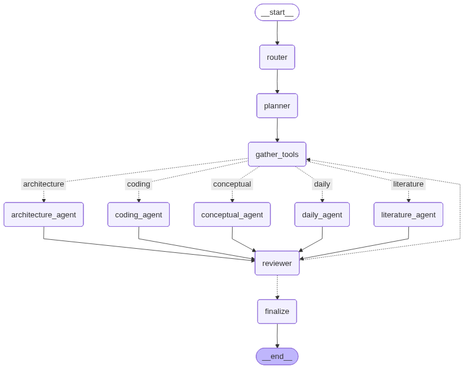

# lab_2_NLP_mas_project

Этот репозиторий содержит мультиагентную систему на **LangGraph**, которая:
- имеет **несколько агентов с разными ролями** (router, planner, специализированные агенты, reviewer, gather_tools);
- реализует паттерны **Router + специализированные агенты** и **Planner → Executor**, а также **циклический workflow** (review → gather_tools → agent);
- демонстрирует **handoff** (передачу управления) между узлами графа через conditional edges;
- использует **tool calling** (ReAct-агенты вызывают инструменты);
- использует **управление памятью**: краткая история в state + долговременные заметки в файле `user_notes.json`.

---

## 1) Архитектура системы


### Агенты и роли

**Router** — классифицирует запрос (intent), подтягивает релевантные заметки из памяти и делает handoff к нужному агенту.

**Planner** — строит краткий план решения (5–10 шагов) в JSON, который дальше используют остальные агенты.

**Gather Tools** — ReAct-агент для добора информации через инструменты по focus, складывает результаты в tool_context.

**Conceptual Agent** — отвечает на теоретические вопросы про MAS/LLM-агентов.

**Architecture Agent** — помогает с проектированием системы: state, маршрутизация/handoff, tools, memory.

**Coding Agent** — пишет исполнимый код и инструкции по запуску, при необходимости вызывает инструменты.

**Daily Agent** — решает повседневные задачи (расчёты, дедлайны, чеклисты) с опорой на инструменты и заметки.

**Literature Agent** — формирует поисковые запросы, критерии отбора и структуру обзора литературы.

**Reviewer** — проверяет полноту/качество ответа; если не хватает данных, выставляет need_more и задаёт focus для повторного вызова tools.

**Finalize** — собирает финальный ответ, обновляет историю и формирует краткое резюме использования памяти.

## 2) Установка
```bash
python -m venv .venv
source .venv/bin/activate
pip install -U pip
pip install -r requirements.txt
````
## 3) Настройка ключа OpenAI
```python
OPENAI_API_KEY=ваш_ключ
MAS_DEFAULT_MODEL=gpt-4o-mini
MAS_NOTES_PATH=user_notes.json
```
## 4) Запуск системы
```python
from src.graph import run_system, build_graph_with_retry_loop, show_graph

# Mermaid-диаграмма графа
app = build_graph_with_retry_loop()
show_graph(app)

out = run_system("Напиши код небольшой программы для вывода чисел в строчку", thread_id="u1")

print("FINAL ANSWER:\n", out["final_answer"])
print("intent:", out["intent"])
print("nodes:", out["activated_nodes"])
print("handoff:", out["handoff_log"])
print("tools_used:", len(out["tool_calls"]))
print("memory:", out["memory_summary"])
```
